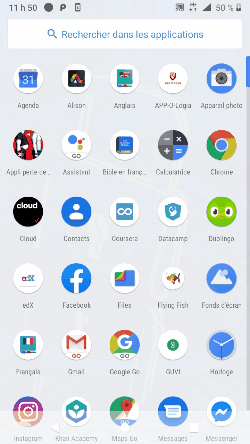

# *Flying Fish*

**Flying Fish** is a simple android game that lets users move a fish to eat some balls.

## User Stories

The following **required** functionality is completed:

- [X] User can touch the screen to move the fish from bottom to top.
- [X] When the fish eats the Yellow ball the score increase by 10.
- [X] When the fish eats the Green ball the score increase by 20.
- [X] When the fish eats the Red or Danger ball one life will be destroy.
- [X] The part is finished when users lost their 3 lifes or fish eats 3 Red ball
- [X] When users lost it will send them to an Activity with the final score and ask if they want to start again or close.

## Video Walkthrough

Here's a walkthrough of implemented user stories:

GIF created with [My Screen Recorder]

## Author
*Developed by Yves Ronaldo CAZEAU*
